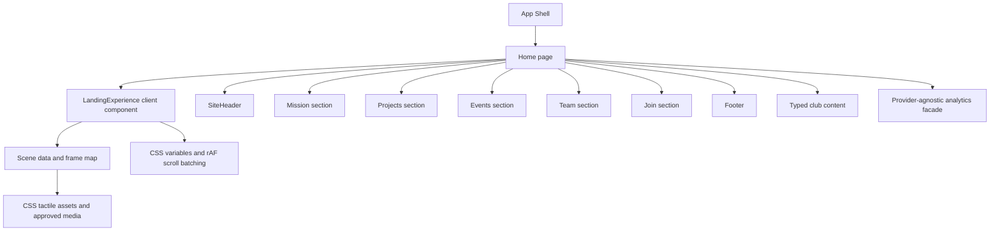
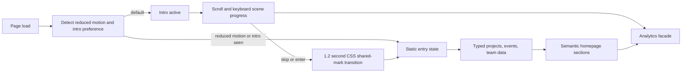

# ChipTech Stop-Motion Redesign Blueprint

## Stack decision

The existing application is a static React 19 and TypeScript site built with Vite, Wouter, Tailwind 4, and shadcn primitives. The redesign preserves that stack rather than replacing it with Next.js. This satisfies the supplied instruction to retain the existing compatible system and avoids an unnecessary framework migration. Client-side state is limited to the intro, navigation, disclosure controls, and preference detection. All essential club content remains in semantic HTML.

## Architecture



## Route and information structure

| Route or anchor | Responsibility | Access route |
|---|---|---|
| `/` and `#intro` | Eight-scene desktop introduction, four-scene mobile simplification | Direct load, skip control, scene links |
| `#about` | Mission and membership proposition | Header navigation |
| `#projects` | Typed project cards, intentionally marked as content-ready placeholders | Header navigation and intro CTA |
| `#events` | Confirmed past-event record and clearly labelled upcoming-event placeholder state | Header navigation |
| `#team` | Team hierarchy with unfilled official roles clearly labelled for replacement | Header navigation |
| `#join` | Interest and collaboration routing through the verified club email | Header navigation and CTA |

## State and data flow



## Scene storyboard

| Scene | Desktop title | Visual composition | Text | Scroll behavior | Mobile and reduced-motion equivalent |
|---:|---|---|---|---|---|
| 1 | Seed | Single cut-paper silicon die on engineering paper | `A question starts small.` | Sticky scene, deliberate 12-step drift | Static chip card |
| 2 | Placement | Die lands on a desk with a printed pin grid | `Put it on the bench.` | Chip settles in three discrete holds | Same card with pin diagram |
| 3 | Labels | Hand-stamped pin labels and diode marks appear | `Name the connections.` | Labels arrive in discrete batches | Full labels visible |
| 4 | Solder | Copper solder line crosses pads | `Make the first bond.` | One stepped path expands | Static solder path |
| 5 | Wiring | Paper and wire traces route to a breadboard | `Route a signal.` | Deterministic line routing | Four core wires visible |
| 6 | Power | Yellow paper power tab and cyan indicator activate | `Give it power.` | Accent turns on once | Visible powered state |
| 7 | System | Components gather into a small working prototype | `Test what changed.` | Parts assemble in four holds | Complete prototype |
| 8 | Community | Prototype opens into labelled student workstreams | `Build it together.` | Paper modules fan into the homepage hero mark | Static community collage and Enter CTA |

The mobile intro groups scenes 1 and 2, scenes 3 through 5, scenes 6 and 7, and scene 8. It never uses pinned multi-viewport scroll. Reduced-motion users receive the complete static collage and immediate entry control.

## Typed content model

```ts
export type ProjectStatus = "content_pending" | "concept" | "research" | "prototyping" | "building" | "testing" | "deployed" | "archived";

export type Project = {
  id: string;
  title: string;
  summary: string;
  category: string;
  technologies: string[];
  status: ProjectStatus;
  updatedAt: string;
  href?: string;
  repositoryUrl?: string;
};

export type ClubEvent = {
  id: string;
  title: string;
  dateLabel: string;
  kind: "record" | "upcoming_placeholder";
  location: string;
  summary: string;
  registrationState: "record" | "coming_soon";
  href?: string;
};
```

No current project or upcoming-event facts are fabricated. The interface exposes the content structure and flags where verified replacements are needed.

## Design tokens

| Token family | Specification |
|---|---|
| Accent | `#00E5FF`, used for live signal and primary action only |
| Ground | `#0A0C0F`, `#11151A`, `#171C22` with paper `#EFE8D8` for tactile contrast |
| Status | Semantic labels and icons pair with color. Placeholder content uses neutral graphite. |
| Typography | Space Grotesk for display and UI, IBM Plex Mono for labels. Four main steps per breakpoint. |
| Spacing | Eight-pixel scale with 16px mobile gutters and 24px desktop gutters. |
| Radii | 4px, 8px, and 16px only. |
| Motion | `160ms`, `240ms`, and `1200ms` with `cubic-bezier(0.23, 1, 0.32, 1)`. Intro uses quantized `steps(12)` timing. |
| Z layers | Base 0, content 10, header 30, menu 40, intro 50. |

## Accessibility and fallback rules

The build uses semantic landmarks and heading order, 44px minimum interaction targets, visible focus styles, labelled controls, and an intro bypass before any motion. Scene state is surfaced in text, not only through position or color. Videos remain silent, have poster fallbacks, and become static under reduced motion. The navigation drawer closes with Escape and returns focus to its trigger. All material event and project content is HTML, not canvas, video, or image-only text.

## Analytics facade

The code exposes a small non-identifying event function that forwards to `window.umami.track` only if it is available. Events include `landing_started`, `landing_scene_viewed`, `landing_skipped`, `landing_completed`, `homepage_transition_completed`, `project_opened`, `event_registration_clicked`, `join_cta_clicked`, and `navigation_clicked`. No personal data is collected in the static frontend.

## Asset manifest

| Asset | Format | Intended location | Priority | Fallback and accessibility treatment |
|---|---|---|---|---|
| Official ChipTech mark | JPG | Existing project storage | High | `alt="ChipTech mark"` |
| Official public cover | JPG | Existing project storage | Medium | Decorative in intro and representative hero support |
| Hero lab loop | MP4, 720p, 6s | Existing project storage | Medium | Poster frame and static cut-paper circuit model |
| Prototype loop | MP4, 720p, 6s | Existing project storage | Lazy | Poster and descriptive visual container |
| Tactile scene objects | CSS and inline HTML | Component and stylesheet | High | Text equivalent in each scene |
| Event evidence image | WebP | Existing project storage | Lazy | Descriptive alt text and source link |

## Performance budget and validation plan

The intro uses CSS and one throttled scroll listener rather than a heavy animation dependency. It does not ship an image frame sequence. Existing media is lazy-loaded outside the first visual moment and hidden on mobile and reduced motion where it would cost more than it communicates. The acceptance checks are TypeScript, Vite production build, desktop and handset screenshots, keyboard reachability, focus visibility, reduced-motion CSS inspection, external-link verification, and console log review.

## Known constraint

The requested 8–12 scene art direction is implemented with deterministic CSS cut-paper objects, not a large illustrated frame sequence. This preserves the tactile story while respecting the existing static deployment model and performance ceiling.
